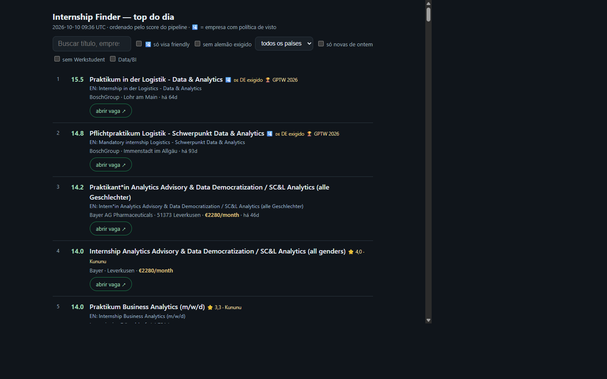
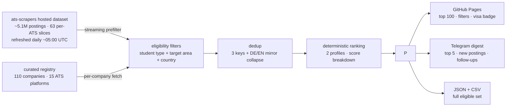

# internship-finder

**A production pipeline that streams ~5 million job postings every day, deduplicates them across 15 ATS platforms, and publishes a ranked, visa-aware shortlist of internships and working-student jobs in Germany.**

[](https://github.com/rios-vini/internship-finder/actions/workflows/ci.yml)
[](https://www.python.org/)
[](LICENSE)
[](https://rios-vini.github.io/internship-finder/)

**→ Live ranking, refreshed every morning at 09:00 UTC:
[rios-vini.github.io/internship-finder](https://rios-vini.github.io/internship-finder/)**



---

## Why I built this

I'm a Materials Engineering student at UFSCar (Brazil) with a mandatory
internship coming in 2027 — and a plan to relocate to Germany with my
family.

When I started searching, I found a fragmented landscape: internships in
Germany are posted as *Praktikum* and *Werkstudent* roles scattered across
dozens of ATS platforms (Workday, SuccessFactors, SmartRecruiters, EURES,
…), many only in German, with no unified view, no fit ranking, and no
signal for which employers actually support visas.

Job boards show you everything. I needed the opposite: a short, ranked,
deduplicated list of the few postings that fit my profile — waiting for me
every morning. So I built the funnel I couldn't find.

Built solo, with AI pair-programming held to a human-grade engineering
bar: every change ships with tests, benchmarks, and byte-identical A/B
proof (see below).

## How it works

A cron job on an Oracle Linux VPS runs the full pipeline once a day and
has done so in production since September 2026:



- **Sources** — a hosted dataset of ~5.1M job postings (streamed slice by
  slice, never fully materialized) plus per-company collection from a
  curated registry of 110 companies across 15 ATS platforms.
- **Filters** — student-type roles (*Praktikum*, *Werkstudent*, internship,
  working student) in Supply Chain / Procurement / BI / Analytics, plus a
  secondary Materials Engineering profile with its own independent
  ranking over the same eligible set.
- **Countries** — Germany (primary, ~85% of volume) + Luxembourg,
  Netherlands, Finland, Belgium.
- **Dedup** — three independent keys (URL, id, normalized title+company)
  plus DE/EN mirror detection collapse the same posting repeated across
  platforms and languages.
- **Ranking** — deterministic, reproducible scoring (no ML) with a full
  per-component breakdown; ties broken by score → title → company → id.
- **Visa signal** — a 🛂 badge marks the 68 companies with a curated,
  sourced visa policy; it is a company-level signal and never enters the
  relevance score.
- **Outputs** — GitHub Pages (top 100 with search and filters), a Telegram
  digest (top 5, what's new, application-tracker follow-up reminders),
  and the full JSON/CSV set.

## By the numbers

| | |
|---|---|
| **~5.1M** | job postings streamed daily from the upstream dataset |
| **771** | eligible jobs in the latest daily run (2026-10-10) → top 100 published |
| **110 / 15** | curated companies / ATS platforms in the registry |
| **5** | target countries (DE primary + LU, NL, FI, BE) |
| **67** | CI test suites, all green on every push |
| **+0.65** | Kendall tau vs. a 59-job human-labeled ranking benchmark |
| **175** | commits — every feature PR merged with CI green twice on the exact merge SHA |

## Engineering decisions worth noticing

- **Dedup that survives the real world.** The same internship shows up on
  three platforms in two languages. Three independent dedup keys plus
  DE/EN mirror detection collapse them to one row — measured, not
  assumed.
- **Deterministic ranking, benchmarked against humans.** No ML, no hidden
  state: every score is reproducible and ships with a per-component
  breakdown. Before trusting it, I labeled 59 real postings by hand and
  measured ordinal agreement (Kendall tau +0.65); the benchmark is
  versioned in-repo and re-runnable.
- **A/B byte-identical before every merge.** Each feature PR proves that
  unchanged paths produce byte-identical outputs, and CI must pass twice
  on the exact merge SHA. Production data is never touched by
  experiments.
- **One gate to production.** The public page goes through a single
  publication gate: secret scanning (zero matches for tokens and server
  paths), atomic writes, and a failure mode that keeps yesterday's site
  online.
- **SQLite with a lifecycle.** Single-writer discipline, archive rotation
  before every run (rollback = copy back), and a backup suite in CI.
- **Kill switches for every optional stage.** LLM enrichment, deadline
  hydration, official-page verification — each default-OFF, each tested.
- **Upstream contributions.** Fixes found while building this went back
  to [`ats-scrapers`](https://github.com/kalil0321/ats-scrapers), the
  library this project builds on.

## Tech stack

**Python 3.12+** · pydantic (canonical `Job` model) · sqlite3 ·
requests / BeautifulSoup · GitHub Actions (67 suites on a clean runner) ·
GitHub Pages · Telegram Bot API · Oracle Linux VPS + cron

## Quickstart

```bash
python3 -m venv .venv
.venv/bin/pip install -e .
.venv/bin/internship-finder        # filter + rank from data/jobs.json
```

Collect from the curated registry — the same command the daily cron runs:

```bash
.venv/bin/internship-finder --registry --country de,lu,nl,fi,be
```

## Testing

67 standalone test suites run on every push (clean runner, Python 3.12,
no network, no local data). Each one prints `[OK]`/`[FAIL]` and exits
non-zero on failure:

```bash
python scripts/test_dedup.py
```

## Documentation

- **[docs/README-operacional.md](docs/README-operacional.md)** — the full
  operational documentation: setup, cron, runbook, coverage tables, and
  the daily-refresh workflow (PT-BR, the repo's working language).
- **[docs/](docs/)** — 33 documents: phase reports, audits, and design
  notes covering every decision and measurement behind the pipeline
  (PT-BR).

## License

[MIT](LICENSE) © 2026 Vinícius Rios
